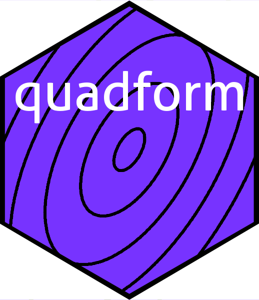

Quadratic forms in R: the `quadform` package
================

<!-- README.md is generated from README.Rmd. Please edit that file -->

# 

<!-- badges: start -->

<!-- badges: end -->

Quadratic forms are polynomials with all terms of degree 2. Given a
column vector ${\mathbf x}=(x_1,\ldots,x_n)^\top$ and an $n\times n$
matrix $M$ then the function
$f\colon\mathbb{R}^n\longrightarrow\mathbb{R}$ given by
$f({\mathbf x})=x^TMx$ is a quadratic form; we extend to complex vectors
by mapping ${\mathbf z}=(z_1,\ldots, z_n)^\top$ to
${\mathbf z}^*M{\mathbf z}$, where $z^*$ means the complex conjugate of
$z^T$. These are implemented in the package with `quad.form(M,x)` which
is essentially

`quad.form <- function(M,x){crossprod(crossprod(M, Conj(x)), x)}.`

This is preferable to `t(x) %*% M %*% x` on several grounds. Firstly, it
streamlines and simplifies code; secondly, it is more efficient; and
thirdly it handles the complex case consistently. The package includes
similar functionality for other related expressions.

The main motivation for the package is nicer code. For example, the
`emulator` package has to manipulate the following expression:

$$
\left[H_x-H^\top A^{-1}U\right]^\top
\left[H^\top\left(H^\top A^{-1}H\right)^{-1}H\right]
\left[H_x-H^\top A^{-1}U\right].
$$

Direct R idiom would be:

    t(Hx - t(H) %*% solve(A) %*% U) %*%  t(H) %*% solve(t(H) %*% solve(A) %*% H) %*% H %*%  (Hx - t(H) %*% solve(A) %*% U)

But `quadform` idiom is:

    quad.form(quad.form.inv(quad.form.inv(A,H),H), Hx - quad3.form.inv(A,H,U))

and in terse form becomes:

    qf(qfi(qfi(A,H),H), Hx - q3fi(A,H,U))

which is certainly shorter, arguably more elegant, and possibly faster.

The package is maintained on
[github](https://github.com/RobinHankin/quadform).
